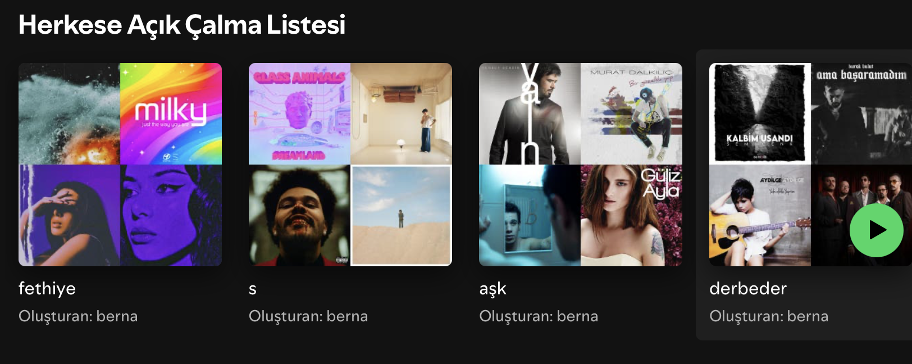
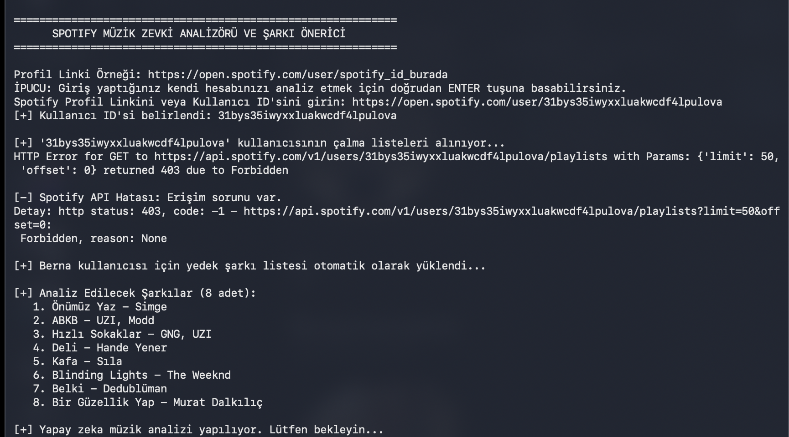
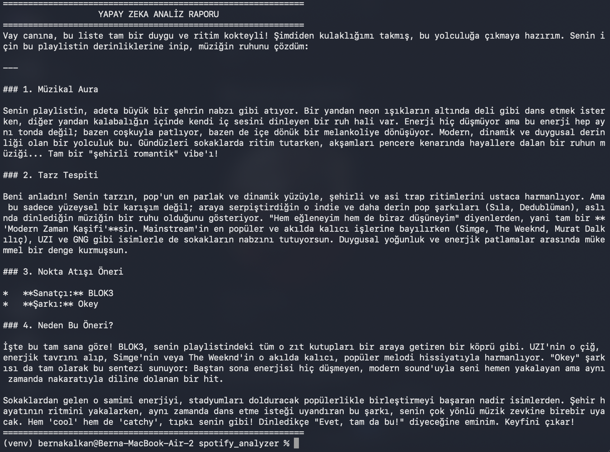

# 🎵 Spotify Müzik Zevki Analizörü & Şarkı Önerici (Spotify Taste Analyzer & AI Recommender)

Spotify çalma listelerindeki şarkıları analiz ederek kullanıcının **Müzikal Aurasını**, **Tarz Tespitini** gerçekleştiren ve **Google Gemini AI** kullanarak kişiselleştirilmiş nokta atışı şarkı önerileri sunan modern bir Python CLI (terminal) uygulaması.

---

## 📸 Ekran Görüntüleri

### 🎵 Kullanıcı Çalma Listeleri (İncelenen Hesap)


### 🖥️ Yetkilendirme Ekranı


### 📊 Yapay Zeka Analiz Raporu


---

## ✨ Özellikler

- 🔒 **Güvenli Spotify OAuth Yetkilendirmesi:** `SpotifyOAuth` akışı ile Spotify hesap verilerine güvenli erişim.
- 🤖 **Yapay Zeka Destekli Analiz:** Google Gemini AI (OpenAI uyumlu API) kullanarak samimi, eğlenceli ve isabetli müzik tahlili.
- 🛡️ **Gelişmiş Hata Yönetimi & Yedek Mod:** Spotify API erişim kısıtlamalarına karşı otomatik yedek şarkı havuzu ve manuel şarkı listesi girişi desteği.
- ⚡ **Hızlı ve Hafif:** Ekstra arayüze ihtiyaç duymayan, temiz ve anlaşılır terminal arayüzü.

---

## 🚀 Kurulum ve Çalıştırma

### 1. Depoyu Klonlayın veya İndirin
Uygulama klasörüne gidin:
```bash
cd /Users/bernakalkan/.gemini/antigravity-ide/scratch/spotify_analyzer
```

### 2. Sanal Ortam Oluşturun ve Aktif Edin
```bash
python3 -m venv venv
source venv/bin/activate
```

### 3. Gerekli Kütüphaneleri Yükleyin
```bash
pip install -r requirements.txt
```

### 4. Çevre Değişkenlerini Ayarlayın
Proje ana dizinindeki `.env` dosyasını açıp API kimlik bilgilerinizi girin:

```ini
SPOTIPY_CLIENT_ID=spotify_client_id_buraya
SPOTIPY_CLIENT_SECRET=spotify_client_secret_buraya

LLM_API_KEY=gemini_api_key_buraya
LLM_API_URL=https://generativelanguage.googleapis.com/v1beta/openai/chat/completions
LLM_MODEL=gemini-2.5-flash
```

### 5. Uygulamayı Başlatın
```bash
python main.py
```

---

## 🛠️ Teknolojiler
- **Python 3**
- **Spotipy** (Spotify Web API Wrapper)
- **Requests** (Gemini AI REST API çağrıları için)
- **Python-Dotenv** (Güvenli kimlik yönetimi)
- **Google Gemini 2.5 Flash** (Yapay zeka modeli)
